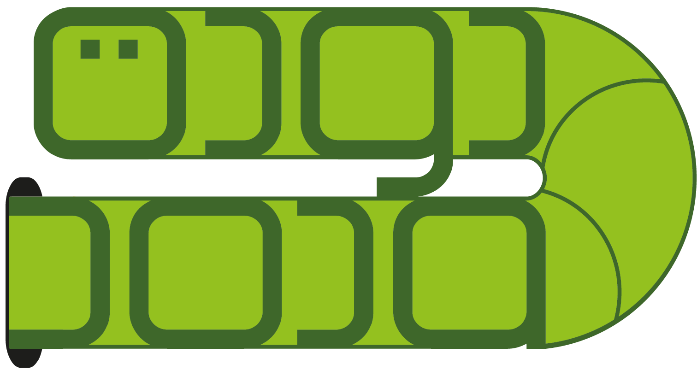
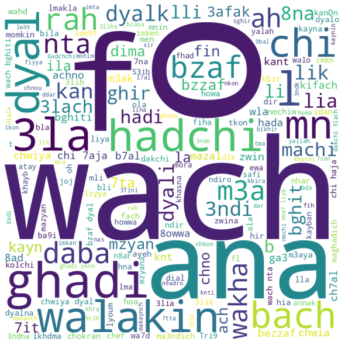

# Darija Open Dataset

<p>
  
  <!--- credits to [https://www.freeflagicons.com/country/morocco/sphere_icon/download/] --->
</p>

Darija Open Dataset (DODa) is an open-source project for the Moroccan dialect. With more than 21,000 entries DODa is arguably the largest open-source collaborative project for Darija <=> English translation built for Natural Language Processing purposes. 

In fact, besides semantic categorization, DODa also adopts a syntactic one, presents words under different spellings, offers verb-to-noun and masculine-to-feminine correspondences, contains the conjugation of hundreds of verbs in different tenses, as well as more that 10,000 translated sentences.


This open source project aims to be a reference in NLP Darija. We hope for the contribution of the Moroccan IT community in order to provide a pedestal for any future application of NLP for the benefit of Moroccans.

---
<p align="center">
  
</p>

[Check out this introductory video about DODa.](https://www.youtube.com/watch?v=IZWuEy7yLB0)

---

## How to contribute

[We've made a tutorial for you in DODa's website](https://darija-open-dataset.github.io/examples/tutorial.html)

---

## Guidelines / Recommendations
1. 3ndk ح dir ح xD (shout-out to [this guy](https://www.facebook.com/watch/?v=238961807618014) 😆), often try to use:

darija | 3 | 7 | 9 | 8 | 2 - 'a' - 'i' | 5 - 'kh'
--- | --- | --- | --- |--- |--- |---
arabic | ع | ح | ق | ه | همزة |  خ  


2. Try to use capitalization to differentiate between the following letters:

| t | T | s | S | d | D |
| :---: | :---: | :---: | :---: | :---: | :---: |
| ت | ط | س | ص | د | ض |


3. Arabic characters with two-letters Latin equivalent:

Arabic alphabet | ش | غ | خ
--- | --- | --- | ---
Latin alphabet | ch | gh | kh


4. Double characters to refer to the emphasis or "الشدة":

darija | 7mam | 7mmam
--- | --- | ---
english | pigeons | bathroom


5. We usually don't add "e" in the end of darija words : `louz` instead of `louze`

6. We usually don't use "Z" or "th" for ظ ، ذ ، ث ,
because we generally don't use these letters in darija (except in northern Morocco, but for the sake of simplicity, we are focusing primarily on standard darija)

7. When using commas, don't forget to surround the expression by quotation marks (as we are using `csv` files)

8. We use spaces as word delimiters, not _ nor - : `thank you` instead of `thank_you`

9. Respect the number of columns in every row you add, you can use empty quotation marks "", or just empty placeholder, in case you don't have extra variations

> "sou9","souk","","market"

> sou9,souk,,market

10. In each row, always start with the most used form (in your opinion of course) of the word in question

11. For future use of this dataset to train deep neural networks, try to reserve each row to similar variations of the same word. For instance, "sou9" and "marchi" both translate to "market", yet it's better to separate them into two different rows:

> sou9,souk,souq,market

> marchi,,,market

12. `verbs.csv`: The darija translation is reserved to the past tense of the third pronoun "he", whereas the other pronouns and tenses are handled in separate files. The English translation present the basic form (or root) of the English verb.

> ghnna,ghenna,ghanna,,,,sing

13. `masculine_feminine_plural.csv`: If it does exist, feminine-plural translation column is for nouns. Regarding adjectives feminine-plural = feminine.

## Citation
```
@misc{outchakoucht2021moroccan,
      title={Moroccan Dialect -Darija- Open Dataset},
      author={Aissam Outchakoucht and Hamza Es-Samaali},
      year={2021},
      eprint={2103.09687},
      archivePrefix={arXiv},
      primaryClass={cs.CL}
}
```
