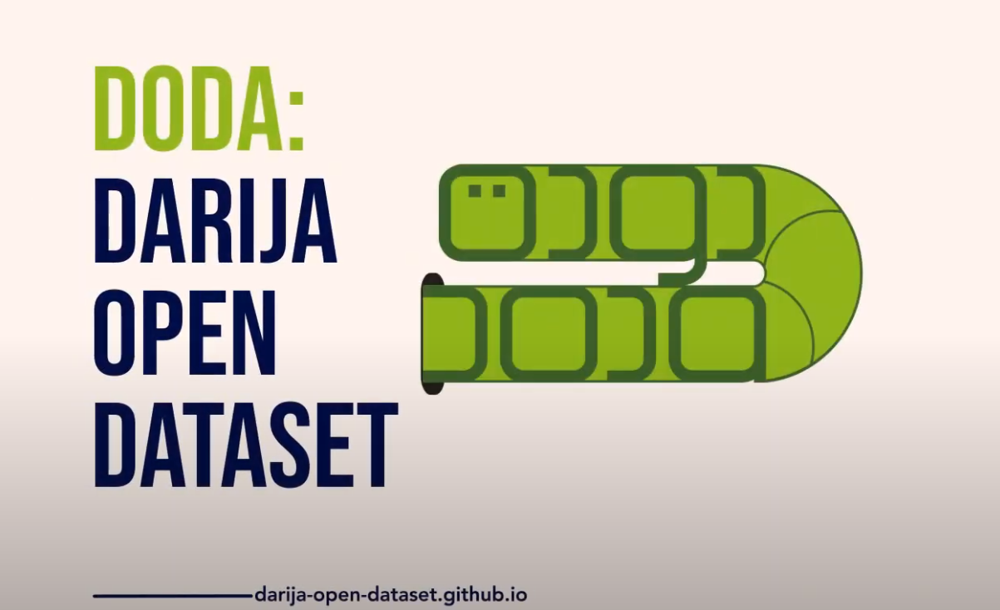

# darija-dictionary

  
  <!--- credits to [https://www.freeflagicons.com/country/morocco/sphere_icon/download/] --->

Having advanced IT solutions that are well adapted to the Moroccan context inevitably passes through understanding the dialect of this country. In other words, darija (Moroccan dialect) should be an active player in the field of Natural Language Processing (NLP).

However, it turns out that step 0 in any serious engagement with darija in NLP is to have the vocabulary translated from darija to the widely used and most documented language in this field, namely English.

This open source project aims to be a reference in addressing this issue. We hope for the contribution of the Moroccan IT community in order to build up the largest dataset of darija-english vocabulary which will serve as a pedestal for any future application of NLP to benefit Moroccan people.

---

---

## How to contribute

[We've made a tutorial for you in DODa's website](https://darija-open-dataset.github.io/examples/tutorial.html)

---

## Guidelines / Recommendations
- 3ndk ح dir ح xD (shout-out to [this guy](https://www.facebook.com/watch/?v=238961807618014) 😆), often try to use:

darija | 3 | 7 | 9 | 8 | 2 - 'a' - 'i' | 5 - 'kh'
--- | --- | --- | --- |--- |--- |---
arabic | ع | ح | ق | ه | همزة |  خ  

- Try to use capitalization to differentiate between the following letters:

| t | T | s | S | d | D |
| :---: | :---: | :---: | :---: | :---: | :---: |
| ت | ط | س | ص | د | ض |

- Arabic characters with two-letters Latin equivalent:

Arabic alphabet | ش | غ | خ
--- | --- | --- | ---
Latin alphabet | ch | gh | kh

- Double characters to refer to the emphasis or "الشدة":

darija | 7mam | 7mmam
--- | --- | ---
english | pigeons | bathroom

- We usually don't add "e" in the end of darija words : `louz` instead of `louze`

- We usually don't use "Z" or "th" for ظ ، ذ ، ث ,
because we generally don't use these letters in darija (except in northern Morocco, but for the sake of simplicity, we are focusing primarily on standard darija)

- We do NOT use apostrophes. In fact, since we are working on `csv` files, apostrophes will break off words

- We use spaces as word delimiters, not _ nor - : `thank you` instead of `thank_you`

- Respect the number of columns in every row you add, you can use empty quotation marks "" in case you don't have extra variations

- In every row, always start with the most used form (in your opinion of course) of the word in question

- For future use of this dataset to train deep neural networks, try to reserve each row to similar variations of the same word. For instance, "sou9" and "marchi" both translate to "market", yet it's better to separate them into two different rows:

> "sou9","souk","souq","market"

> "marchi","","","market"

- `verbs_1.csv`: The darija translation is reserved to the past tense of the third pronoun "he", whereas the other pronouns and tenses are handled in separate files. The English translation present the basic form (or root) of the English verb.

> "ghnna","ghenna","ghanna","","","","sing"

- `masculine_feminine_plural.csv`: If it does exist, feminine-plural translation column is for nouns. Regarding adjectives feminine-plural = feminine.
