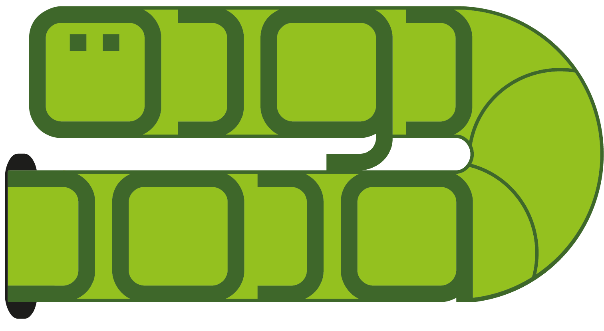

# Darija Open Dataset

<p>
  
  <!--- credits to [https://www.freeflagicons.com/country/morocco/sphere_icon/download/] --->
</p>

Welcome to the Darija Open Dataset (DODa), an ambitious open-source project dedicated to the Moroccan dialect. With about 150,000 human entries, DODa is arguably the largest open-source collaborative project for Darija <=> English translation built for Natural Language Processing purposes.

In fact, besides semantic categorization, DODa also adopts a syntactic one, presents words under different spellings, offers verb-to-noun and masculine-to-feminine correspondences, contains the conjugation of hundreds of verbs in different tenses, as well as about 49,000 reviewed translated sentences in `sentences/sentences.csv`. For machine translation training, we also release **DODa-500K**: a single combined parallel file with 500,350 rows (48,350 human + 452,000 synthetic), labeled so you can tell human and generated data apart.

Additionally, DODa takes into account the diversity of Darija spellings used in various contexts, making it a versatile resource for language enthusiasts and NLP practitioners. The dataset includes entries written in both Latin and Arabic alphabets, reflecting the linguistic variations and preferences found in different sources and applications.

Our primary goal is to establish DODa as the go-to reference for NLP in Darija. By providing a robust and diverse dataset, we aim to facilitate the development of NLP applications that can cater to the specific linguistic needs of the Moroccan community.

While we have made significant progress in compiling and organizing the dataset, it's important to note that parts of the dataset are still either under review or in progress, especially in the *sentences.csv* file. We welcome contributions from the Moroccan IT community to help us refine and expand the dataset further, ensuring its accuracy and completeness. Together, we can build a powerful foundation for future NLP innovations tailored to Moroccan culture and language.

---
[Check out this introductory video about DODa.](https://www.youtube.com/watch?v=IZWuEy7yLB0)
---
## DODa-500K (combined parallel file)

If you want one file for Darija ↔ English MT, use **DODa-500K**. It merges the reviewed human sentences from `sentences/sentences.csv` with a controlled synthetic expansion into a single downloadable file.

| Portion | Rows | Filter |
|---|---:|---|
| Human | 48,350 | `generation_mode == "doda_human"` or `source == "doda"` |
| Synthetic (DODa-grounded) | 226,000 | `generation_mode == "doda_grounded"` |
| Synthetic (exploratory) | 226,000 | `generation_mode == "exploratory"` |
| **Total** | **500,350** | — |

Each row has Arabic-script Darija, Latin/Arabizi Darija, and English, plus provenance fields (`generation_mode`, `source`, and for synthetic rows also `register`, `domain`, `code_switch`).

Synthetic rows are good quality model-generated sentences, they are **not** human-validated. Filter to `doda_human` when you need gold Darija only.

The human lexicon, conjugations, `sentences/sentences.csv`, and `ongoing/` contribution files are unchanged. Do not add synthetic rows to those CSVs.

## How to contribute

You're free to navigate straight to the [AtlasIA](https://atlasia.ma) interface and start your contributions 🔥🔥.

Otherwise, if you prefer using dev tools, we've made a [detailed video](https://www.youtube.com/watch?v=gyuTSJgux4s&ab_channel=DODa) for you on how to contribute

TL;DW (Too Long Didn't Watch):
1. Go to [Issues](https://github.com/darija-open-dataset/dataset/issues)
2. Choose one and comment to have it assigned to you
3. Fork the [Dataset Repository](https://github.com/darija-open-dataset/dataset)
4. Translate and fix typos in the file corresponding to your assigned issue 
5. Open a Pull Request 
6. Do **not** edit DODa-500K / `doda-500k/` for contributions. New human translations go through Issues → `ongoing/` or `sentences/` as above.

Thank you for your contribution!!!
---

## Guidelines / Recommendations
1. 3ndk ح dir ح xD (shout-out to [this guy](https://www.facebook.com/watch/?v=238961807618014) 😆), often try to use:

darija | 3 | 7 | 9 | 8 | 2 - 'a' - 'i' | 5 - 'kh'
--- | --- | --- | --- |--- |--- |---
arabic | ع | ح | ق | ه | همزة |  خ  


2. Try to use capitalization to differentiate between the following letters:

| t | T | s | S | d | D |
| :---: | :---: | :---: | :---: | :---: | :---: |
| ت | ط | س | ص | د | ض |


3. Arabic characters with two-letters Latin equivalent:

Arabic alphabet | ش | غ | خ
--- | --- | --- | ---
Latin alphabet | ch | gh | kh


4. Double characters to refer to the emphasis or "الشدة":

darija | 7mam | 7mmam
--- | --- | ---
english | pigeons | bathroom


5. We usually don't add "e" in the end of darija words : `louz` instead of `louze`

6. We usually don't use "Z" or "th" for ظ ، ذ ، ث ,
because we generally don't use these letters in darija (except in northern Morocco, but for the sake of simplicity, we are focusing primarily on standard darija)

7. When using commas, don't forget to surround the expression by quotation marks (as we are using `csv` files)

8. We use spaces as word delimiters, not _ nor - : `thank you` instead of `thank_you`

9. Respect the number of columns in every row you add, you can use empty quotation marks "", or just empty placeholder, in case you don't have extra variations

> "sou9","souk","","سوق","market"

> sou9,souk,,مارشي,market

10. In each row, always start with the most used form (in your opinion of course) of the word in question

11. For future use of this dataset, try to reserve each row to similar variations of the same word. For instance, "sou9" and "marchi" both translate to "market", yet it's better to separate them into two different rows:

> sou9,souk,souq,سوق,market

> marchi,,,مارشي,market

12. `verbs.csv`: The darija translation is reserved to the past tense of the third pronoun "he", whereas the other pronouns and tenses are handled in separate files. The English translation present the basic form (or root) of the English verb.

> ghnna,ghenna,ghanna,,,,غنّا,sing

13. `masculine_feminine_plural.csv`: If it does exist, feminine-plural translation column is for nouns. Regarding adjectives feminine-plural = feminine.

14. Never mix synthetic / DODa-500K rows into `sentences/sentences.csv` or `ongoing/*.csv`. Those files stay human-only. The combined MT file lives separately under `doda-500k/` (and on Hugging Face).

## PyDODa - Python wrapper for the DODa


Pydoda is a comprehensive Python library that simplifies access and analysis of the DODa dataset. It enables effortless exploration of linguistic content for researchers, developers, and language enthusiasts by providing an intuitive interface for accessing various dataset categories, retrieving spellings and translations.

Note: PyDODa wraps the **human** DODa CSVs (semantic, syntactic, sentences, etc.). It does not load DODa-500K. For the combined parallel file, download it from Hugging Face / `doda-500k/` and filter with `generation_mode` / `source`.

Integrating Pydoda into your Python workflow grants access to a wide range of functionalities, facilitating insights extraction from the DODa dataset, including semantic and syntactic analysis, translation retrieval, spelling variations exploration, and more.

### Usage example
Pydoda could easily be installed using `pip`:
```
pip install pydoda
```
Here is a small code snippet:
```
from pydoda import Category

# Create an instance of Category
my_category = Category('semantic', 'animals')

# Get the Darija translation of a word
darija_translation = my_category.get_darija_translation('dog')
print(darija_translation)
# Output: klb

# Get the English translation of a word
english_translation = my_category.get_english_translation('mch')
print(english_translation)
# Output: 'cat'
```

For further details, visit the [official Pydoda GitHub repository](https://github.com/saad-out/pydoda) & [official Pydoda documentation](https://saad-out.github.io/pydoda/).

## Usage Terms

- **Research and Personal Use**: You are welcome to use DODa for research, personal projects, and educational purposes, free of charge, in accordance with the terms of the [open-source license](https://github.com/darija-open-dataset/dataset/blob/main/LICENSE)

- **Commercial Use**: For commercial purposes or any other usage not covered by the [open-source license](https://github.com/darija-open-dataset/dataset/blob/main/LICENSE), please contact the copyright holders Aissam or Hamza to discuss licensing options and permissions.

## Citation
```
@misc{outchakoucht2024evolution,
      title={The Evolution of Darija Open Dataset: Introducing Version 2}, 
      author={Aissam Outchakoucht and Hamza Es-Samaali},
      year={2024},
      eprint={2405.13016},
      archivePrefix={arXiv},
      primaryClass={cs.CL}
}
```

```
@misc{outchakoucht2021moroccan,
      title={Moroccan Dialect -Darija- Open Dataset},
      author={Aissam Outchakoucht and Hamza Es-Samaali},
      year={2021},
      eprint={2103.09687},
      archivePrefix={arXiv},
      primaryClass={cs.CL}
}
```
